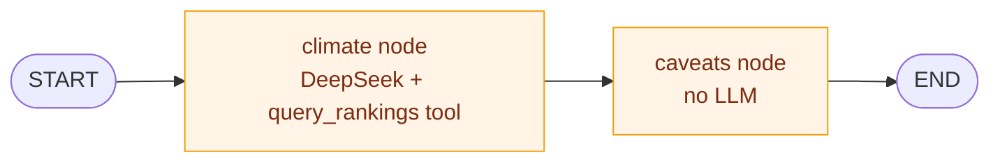

# climate_agent

A conversational front-end for [`../climate`](../climate), built on
[LangGraph](https://github.com/langchain-ai/langgraph). Two nodes, one edge: a
tool-calling `climate` node answers with DeepSeek and a SQL tool, then hands its
draft to a `caveats` node that appends the honesty notes a chat answer would
otherwise strip — no LLM, and no idea what `climate` was thinking.

One process, one graph — behind either a CLI or a React UI that shows what each
step cost.

```
src/climate_agent/
  schemas.py     Step/Final types the gateway yields and the API serializes
  progress.py    LangGraph custom-stream step emitter
  query.py       DuckDB over ./data/*.csv
  climate.py     the graph: DeepSeek + query_rankings tool -> caveats
  caveats.py     the honesty sidecar (no LLM)
  gateway.py     session bookkeeping + the CLI repl
  api/app.py     FastAPI: /api/ask (SSE) + the built UI
data/            rankings.csv, sensitivity.csv — vendored, not a sibling checkout
frontend/        Vite + React 19 + TS; npm run build -> dist/, which the API mounts
```

## The graph



`climate` writes `answer` into the graph's state and knows nothing about what
runs next. `caveats` reads that state and writes `caveats` into it — the graph's
own edge is what hands the draft over, not a call `climate` makes. Deleting the
`caveats` node would leave `climate` working and the user simply never seeing a
caveat.

Progress narration works the same way: both nodes call `progress.timed(...)`,
which reaches for whichever graph run is currently executing via LangGraph's
`get_stream_writer()` and writes a `Step` onto its custom stream. Nothing
downstream depends on these — an agent that never narrates itself still works,
it just shows up as a black box.

### One question, end to end

```mermaid
sequenceDiagram
    autonumber
    participant U as CLI / browser
    participant GW as Gateway
    participant T as background task
    participant G as graph.astream()
    participant CL as climate node
    participant CV as caveats node

    U->>GW: stream("where is mild?")
    GW->>T: create_task(_run(...))
    Note over GW: reads the queue; does not drive the graph itself
    T->>G: astream(state, stream_mode=["custom","values"])
    G->>CL: run
    CL->>G: Step(answer, start) [custom]
    G-->>T: forwarded
    T-->>GW: step
    GW-->>U: step
    loop each tool call
        CL->>G: Step(sql, start), then Step(sql, done) + ms [custom]
        G-->>T: forwarded
        T-->>GW: step
        GW-->>U: step
    end
    G->>CV: run (climate's answer is now in state)
    CV->>G: Step(caveats, done) [custom]
    G-->>T: forwarded
    G->>T: final state (answer + caveats) [values]
    T->>T: save history, record conversation
    T-->>GW: final
    GW->>U: answer + caveats
```

**The CLI never needed the queue indirection**: its REPL blocks on `input()`
and then on `ask()`, so exactly one question is ever in flight. The HTTP API is
what makes it load-bearing — two browser tabs are two concurrent `stream()`
calls, each with its own background task, its own queue, and its own graph run.
Nothing needs correlating between them, because nothing is shared: unlike the
old pub/sub build, there's no single channel two questions' events could ever
land on together.

**Disconnects don't cancel the answer.** `stream()` reads a queue that a
background task is filling; it never drives the graph itself. A browser tab
that closes mid-answer stops the *reading*, not the *answering* — the task
keeps running, still calls `_record` when it finishes, and the conversation
still shows up when you come back. `test_an_abandoned_stream_still_records_its_answer`
covers exactly that.

## What each node does

**Gateway** (`gateway.py`) is the human end. `stream(text, session_id)` starts a
background task that drives one `graph.astream()` call and pushes events into a
private queue; `stream()` itself just reads that queue until a `Final` arrives.
`ask()` is `stream()` with the progress discarded, which is all the CLI needs;
the SSE endpoint forwards the whole thing. It also writes the *readable*
transcript of each conversation — question, answer, caveats — because only this
end sees the finished answer: caveats are attached downstream and never travel
back to the model, so the history (what the model sees) can't reconstruct what
the human was shown.

**`climate` node** (`climate.py`) answers questions with DeepSeek and a single
`query_rankings(sql)` tool over `data/rankings.csv` (1118 cities × 47 columns)
and `data/sensitivity.csv`. Built with `langchain.agents.create_agent` — a
ReAct tool-calling loop — wrapped in a graph node so its own progress events
(emitted from inside the tool, several frames down) get forwarded onto the
outer graph's stream.

**`caveats` node** (`caveats.py`) is why the graph earns its keep. It reads the
draft `climate` wrote and appends the caveats a chat answer would otherwise
strip — grid-cell microclimate risk, ranks that are unstable across scoring
variants, sub-500k reference cities, metric ambiguity. It uses no LLM — every
caveat is a lookup against columns the climate pipeline already computes. It
finds the cities by matching names against the answer text.

That inversion is the point: in a plain tool-calling loop the critic has to be
wired in by the thing being criticised. Here it's just the next node in the
graph, reading state `climate` wrote but
never calling into.

## Running it

Needs `DEEPSEEK_API_KEY` in `.env` (or the environment). The ranking data ships
in `data/` — no sibling checkout required.

```sh
uv sync
make build          # npm install + vite build -> frontend/dist
make redis          # session storage
make api            # http://127.0.0.1:8000  (serves the built UI)
```

For UI work, run the two dev servers side by side — Vite on :5173 hot-reloads and
proxies `/api` to uvicorn, so the SSE stream stays same-origin and needs no CORS:

```sh
make api            # shell 1
make ui             # shell 2 -> http://localhost:5173
```

The CLI is still there and is fed by the identical events:

```sh
make cli
```

```
you> Which city has the most comfortable daylight hours per year?

On raw comfort hours, Tijuana, México leads with 4,413 comfortable daylight hours
per year, just ahead of Lima (4,360) and Valparaíso (4,268).

Lima holds rank 1 overall because the headline ranking uses the composite (3,642 vs
Tijuana's 3,495), which rewards Lima's more even seasonal spread and higher comfort
fraction (94% of daylight hours vs 93%).

Caveats
  - Microclimate risk (coastal + relief): the ERA5 grid cell may not represent
    conditions in the city itself for Tijuana, Lima, Valparaíso. 578 of the 1118
    cities carry this flag.
  - Lima's position is unstable: across the 17 scoring variants its rank spans
    12 places (median 6). Treat it as indicative, not exact.
```

| Env var | Effect |
|---|---|
| `DEEPSEEK_API_KEY` | Required. |
| `CLIMATE_OUT_DIR` | Where `rankings.csv` lives. Defaults to `./data`. |
| `LOG_LEVEL` | `INFO` shows each turn as it's handled. `DEBUG` adds every SQL statement the model runs, with row count and timing — including the ones the read-only guard refuses. Noisy third-party loggers are pinned to `WARNING` so they don't bury it. |
| `PORT` | API port, default 8000. |
| `STATIC_DIR` | Where the built UI lives, default `frontend/dist`. |

```sh
make test            # 72 tests, no API key needed — the model is stubbed
make format lint     # ruff, line length 88
```

## Deploying to Railway

The Dockerfile builds the frontend and the API into one image; Railway needs a
project, a Redis plugin for session storage, and `DEEPSEEK_API_KEY`.

```sh
railway login                              # interactive, opens a browser
railway init                               # new project
railway add --database redis               # managed Redis plugin
railway variables --set DEEPSEEK_API_KEY=sk-...
railway up                                 # build + deploy from the Dockerfile
railway domain                             # public URL
```

`REDIS_URL` is wired automatically once the Redis plugin is attached — Railway
injects it as a reference variable. `PORT` is supplied by Railway at runtime;
the Dockerfile's `CMD` reads it directly.

## Known rough edges

- The climate node often mentions a caveat itself (it can read
  `microclimate_risk`), so the sidecar sometimes repeats it. Left as-is: the
  point of the sidecar is that the caveat is guaranteed, not that it is unique.
- City-name matching is a regex over the 1118 published names, minimum 4
  characters. It will miss a city referred to obliquely and can in principle
  match a name inside an unrelated word.
- `query.py` guards the model's SQL with an opening-keyword allowlist plus a
  denylist for the statements that reach the filesystem. Adequate for a small
  deployment; a larger one wants a genuinely read-only DuckDB connection.
- DeepSeek doesn't expose the "busy, come back later" vs. "something broke"
  distinction as cleanly as Anthropic's 529 did; `climate._busy` treats 429
  (rate limited) and 503 (overloaded) as the retry-worthy case and everything
  else as a hard failure.

## Where to take it next

The obvious next lesson is fan-out/gather — "compare Porto, Lisbon and
Valencia" fans out to N parallel `climate` sub-calls (LangGraph's `Send` API)
with a joiner node that waits for all of them before handing off to `caveats`.
After that, a `checkpointer` (e.g. `RedisSaver`) would move session state fully
into LangGraph's own persistence instead of the hand-rolled `store.py`.
